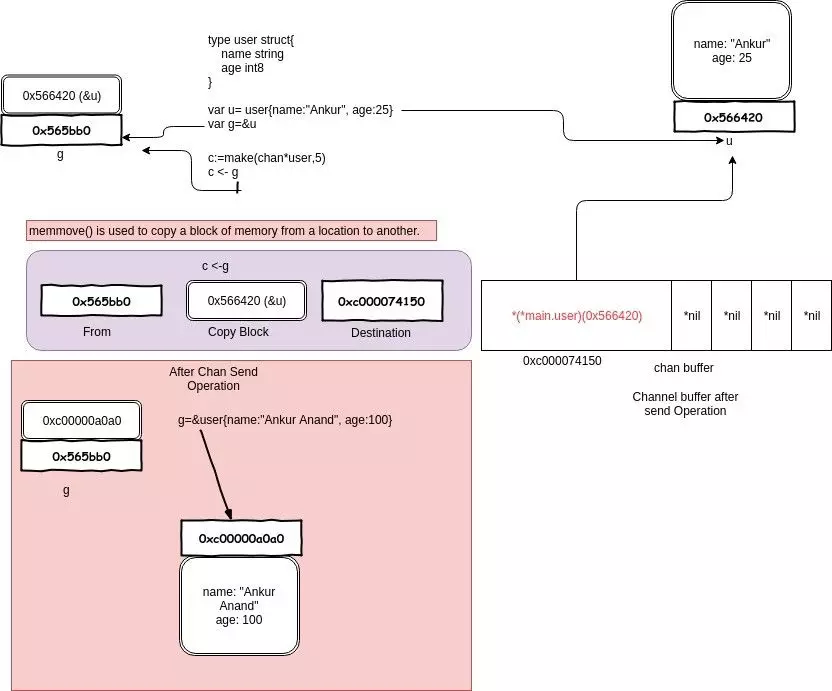

go有关channel的注意事项。
<!--more-->


## 一个测试题

```go
func main() {
	defer func() {
		fmt.Println("defer start...")
		if err := recover(); err != nil {
			fmt.Printf("err1:%v\n", err)
		}
		fmt.Println("defer end...")
	}()
	c := make(chan int)
	// var c chan int
	go func() {
		// defer func() {
		// 	if err := recover(); err != nil {
		// 		fmt.Printf("err2:%v\n", err)
		// 	}
		// }()
		c <- 1
	}()
	// 以下两行代码对调的话，运行就正常了，否则会 panic
	close(c)
	fmt.Println(<-c)

	for i := 0; i < 100; i++ {
		cc, ok := <-c
		if ok {
			fmt.Println(cc)
		}
		// fmt.Println(<-c)

	}
}
```

这个输出会是什么呢？我执行了4次，每一次可能不一样，如下：

```shell
go run main.go
0
panic: send on closed channel

goroutine 33 [running]:
main.deferChannel.func2(0xc0000b2000)
	/Users/liwei/golang/src/somecodes/zl/main.go:28 +0x37
created by main.deferChannel
	/Users/liwei/golang/src/somecodes/zl/main.go:22 +0x97
exit status 2

go run main.go
0
defer start...
defer end...
panic: send on closed channel

goroutine 33 [running]:
main.deferChannel.func2(0xc0000b4000)
	/Users/liwei/golang/src/somecodes/zl/main.go:28 +0x37
created by main.deferChannel
	/Users/liwei/golang/src/somecodes/zl/main.go:22 +0x97
exit status 2

go run main.go
0
panic: send on closed channel

goroutine 5 [running]:
main.deferChannel.func2(0xc000022060)
	/Users/liwei/golang/src/somecodes/zl/main.go:28 +0x37
created by main.deferChannel
	/Users/liwei/golang/src/somecodes/zl/main.go:22 +0x97
exit status 2

go run main.go
0
panic: send on closed channel

goroutine 18 [running]:
main.deferChannel.func2(0xc0000b4000)
	/Users/liwei/golang/src/somecodes/zl/main.go:28 +0x37
created by main.deferChannel
	/Users/liwei/golang/src/somecodes/zl/main.go:22 +0x97
exit status 2
```


对于这个示例代码中的一些问题总结：

1. goroutine 里面的 panic ，在外面是不能被 recover() 的，所以在recover()里面的流程永远不会执行。
2. chan 是阻塞式的。
3. 从已关闭的 chan 读数据永远不会阻塞，一律返回空值。所以会先返回0值，由于**对于从无缓存通道进行的接收，发生在对该通道进行的发送完成之前**。所以close(c)一定在协和写c<-1操作的前面执行。
4. 向已关闭的 chan 以任何形式写数据都会 panic。
   - 如果我们先调用 `go func() {c <- 1}()`，然后关闭 chan，此时再读取 chan 是有可能成功读取到数据，但是系统调度到执行 go func （即当我们向关闭的chan send 数据时，会报错 panic: send on closed channel）。
5. defer 只针对当前协程有效。
   - 当主函数都执行完了，函数中的协程也没执行完，并且 chan 关闭，再在协程中写数据， recover() 是不会报错的，因为我主函数执行完都还没有执行到协程中 chan 写数据。
   - 当主函数未执行完就执行协程中的写数据，并且在写之前 chan 已经关闭，则会执行 defer，但是 recover() 没有捕捉到错误，因为错误发生在另外一个协程中。
6. 关闭一个 `nil channel` 会发生 panic。

## 概念

### 状态与操作

[channel用法](https://segmentfault.com/a/1190000017958702)

channel存在`3种状态`：

1. nil，未初始化的状态，只进行了声明，或者手动赋值为`nil`

2. active，正常的channel，可读或者可写
3. closed，已关闭，**千万不要误认为关闭channel后，channel的值是nil**

channel可进行`3种操作`：

1. 读
2. 写
3. 关闭

把这3种操作和3种channel状态可以组合出`9种情况`：

| 操作      | nil的channel | 正常channel | 已关闭channel |
| :-------- | :----------- | :---------- | :------------ |
| <- ch     | 阻塞         | 成功或阻塞  | 读到零值      |
| ch <-     | 阻塞         | 成功或阻塞  | panic         |
| close(ch) | panic        | 成功        | panic         |

总结一下，发生 panic 的情况有三种：向一个关闭的 channel 进行写操作；关闭一个 nil 的 channel；重复关闭一个 channel。

读、写一个 nil channel 都会被阻塞。

对于nil通道的情况，也并非完全遵循上表，**有1个特殊场景**：当`nil`的通道在`select`的某个`case`中时，这个case会阻塞，但不会造成死锁。

*参考代码请看：https://dave.cheney.net/2014/...*

## **发送和接收元素的本质**

Channel 发送和接收元素的本质是什么？参考资料【深入 channel 底层】里是这样回答的：

> Remember all transfer of value on the go channels happens with the copy of value.

就是说 channel 的发送和接收操作本质上都是 “**值的拷贝**”，无论是从 sender goroutine 的栈到 chan buf，还是从 chan buf 到 receiver goroutine，或者是直接从 sender goroutine 到 receiver goroutine。

这里再引用文中的一个例子，我会加上更加详细地解释。顺带说一下，这是一篇英文的博客，写得很好，没有像我们这篇文章那样大段的源码分析，它是将代码里情况拆开来各自描述的，各有利弊吧。推荐去读下原文，阅读体验比较好。

```go
type user struct {
	name string
	age int8
}
var u = user{name:"Ankur", age:25}
var g = &u

func modifyUser(pu *user) {
	fmt.Println("modifyUser Received Value: ", pu)
	pu.name = "Anand"
}

func printUser(u <-chan *user) {
	time.Sleep(2 * time.Second)
	fmt.Println("printUser goRoutine called: ", <-u)
}

func main() {
	c := make(chan *user, 5)
	c <- g
	fmt.Println(g)
	// modify g
	g = &user{name:"Ankur Anand", age:100}
	go printUser(c)
	go modifyUser(g)
	time.Sleep(5 * time.Second)
	fmt.Println(g)
}
```

运行结果：

```bash
&{Ankur 25}
modifyUser Received Value:  &{Ankur Anand 100}
printUser goRoutine called:  &{Ankur 25}
&{Anand 100}
```

这里就是一个很好的 `share memorybycommunicating` 的例子。



一开始构造一个结构体 u，地址是 0x56420，图中地址上方就是它的内容。接着把 `&u`赋值给指针 `g`，g 的地址是 0x565bb0，它的内容就是一个地址，指向 u。

main 程序里，先把 g 发送到 c，根据 `copy value` 的本质，进入到 chan buf 里的就是 `0x56420`，它是指针 g 的值（不是它指向的内容），所以打印从 channel 接收到的元素时，它就是 `&{Ankur25}`。因此，这里并不是将指针 g “发送” 到了 channel 里，只是拷贝它的值而已。

再强调一次：

> Remember all transfer of value on the go channels happens with the copy of value.

## **资源泄漏**

Channel 可能会引发 goroutine 泄漏。

泄漏的原因是 goroutine 操作 channel 后，处于发送或接收阻塞状态，而 channel 处于满或空的状态，一直得不到改变。同时，垃圾回收器也不会回收此类资源，进而导致 gouroutine 会一直处于等待队列中，不见天日。

雨痕老师的《Go 语言学习笔记》第 8 章通道的“资源泄露”一节举了个例子，大家可以自己去看。

## happened before

维基百科上给的定义：

> In computer science, the happened-before relation (denoted: ->) is a relation between the result of two events, such that if one event should happen before another event, the result must reflect that, even if those events are in reality executed out of order (usually to optimize program flow).

简单来说就是如果事件 a 和事件 b 存在 happened-before 关系，即 a -> b，那么 a，b 完成后的结果一定要体现这种关系。由于现代编译器、CPU 会做各种优化，包括编译器重排、内存重排等等，在并发代码里，happened-before 限制就非常重要了。

根据晃岳攀老师在 Gopher China 2019 上的并发编程分享，关于 channel 的发送（send）、发送完成（send finished）、接收（receive）、接收完成（receive finished）的 happened-before 关系如下：

1. 第 n 个 `send` 一定 `happened before` 第 n 个 `receive finished`，无论是缓冲型还是非缓冲型的 channel。
2. 对于容量为 m 的缓冲型 channel，第 n 个 `receive` 一定 `happened before` 第 n+m 个 `send finished`。
3. 对于非缓冲型的 channel，第 n 个 `receive` 一定 `happened before` 第 n 个 `send finished`。
4. channel close 一定 `happened before` receiver 得到通知。

我们来逐条解释一下。

第一条，我们从源码的角度看也是对的，send 不一定是 `happened before` receive，因为有时候是先 receive，然后 goroutine 被挂起，之后被 sender 唤醒，send happened after receive。但不管怎样，要想完成接收，一定是要先有发送。

第二条，缓冲型的 channel，当第 n+m 个 send 发生后，有下面两种情况：

若第 n 个 receive 没发生。这时，channel 被填满了，send 就会被阻塞。那当第 n 个 receive 发生时，sender goroutine 会被唤醒，之后再继续发送过程。这样，第 n 个 `receive` 一定 `happened before` 第 n+m 个 `send finished`。

若第 n 个 receive 已经发生过了，这直接就符合了要求。

第三条，也是比较好理解的。第 n 个 send 如果被阻塞，sender goroutine 挂起，第 n 个 receive 这时到来，先于第 n 个 send finished。如果第 n 个 send 未被阻塞，说明第 n 个 receive 早就在那等着了，它不仅 happened before send finished，它还 happened before send。

第四条，回忆一下源码，先设置完 closed = 1，再唤醒等待的 receiver，并将零值拷贝给 receiver。

参考资料【鸟窝 并发编程分享】这篇博文的评论区有 PPT 的下载链接，这是晁老师在 Gopher 2019 大会上的演讲。

关于 happened before，这里再介绍一个柴大和曹大的新书《Go 语言高级编程》里面提到的一个例子。

书中 1.5 节先讲了顺序一致性的内存模型，这是并发编程的基础。

我们直接来看例子：

```go
var done = make(chan bool)
var msg string

func aGoroutine() {
    msg = "hello, world"
    done <- true
}

func main() {
    go aGoroutine()
    <-done
    println(msg)
}
```

先定义了一个 done channel 和一个待打印的字符串。在 main 函数里，启动一个 goroutine，等待从 done 里接收到一个值后，执行打印 msg 的操作。如果 main 函数中没有 `<-done` 这行代码，打印出来的 msg 为空，因为 aGoroutine 来不及被调度，还来不及给 msg 赋值，主程序就会退出。而在 Go 语言里，主协程退出时不会等待其他协程。

加了 `<-done` 这行代码后，就会阻塞在此。等 aGoroutine 里向 done 发送了一个值之后，才会被唤醒，继续执行打印 msg 的操作。而这在之前，msg 已经被赋值过了，所以会打印出 `hello, world`。

这里依赖的 happened before 就是前面讲的第一条。第一个 send 一定 happened before 第一个 receive finished，即 `done <- true` 先于 `<-done` 发生，这意味着 main 函数里执行完 `<-done` 后接着执行 `println(msg)` 这一行代码时，msg 已经被赋过值了，所以会打印出想要的结果。

书中，又进一步利用前面提到的第 3 条 happened before 规则，修改了一下代码：

```go
var done = make(chan bool)
var msg string

func aGoroutine() {
    msg = "hello, world"
    <-done
}

func main() {
    go aGoroutine()
    done <- true
    println(msg)
}
```

同样可以得到相同的结果，为什么？根据第三条规则，对于非缓冲型的 channel，第一个 receive 一定 happened before 第一个 send finished。也就是说，
在 `done <- true` 完成之前，`<-done` 就已经发生了，也就意味着 msg 已经被赋上值了，最终也会打印出 `hello, world`。

## 如何优雅地关闭 channel

这部分内容主要来自 Go 101 上的一篇英文文章，参考资料【如何优雅地关闭 channel】可以直达原文。

文章先“吐槽”了下 Go channel 在设计上的一些问题，接着给出了几种不同情况下如何优雅地关闭 channel 的例子。按照惯例，我会在原作者内容的基础上给出自己的解读，看完这一节你可以再回头看一下英文原文，会觉得很有意思。

关于 channel 的使用，有几点不方便的地方：

1. 在不改变 channel 自身状态的情况下，无法获知一个 channel 是否关闭。
2. 关闭一个 closed channel 会导致 panic。所以，如果关闭 channel 的一方在不知道 channel 是否处于关闭状态时就去贸然关闭 channel 是很危险的事情。
3. 向一个 closed channel 发送数据会导致 panic。所以，如果向 channel 发送数据的一方不知道 channel 是否处于关闭状态时就去贸然向 channel 发送数据是很危险的事情。

文中还真的就给出了一个检查 channel 是否关闭的函数：

```go
func IsClosed(ch <-chan T) bool {
    select {
    case <-ch:
        return true
    default:
    }

    return false
}

func main() {
    c := make(chan T)
    fmt.Println(IsClosed(c)) // false
    close(c)
    fmt.Println(IsClosed(c)) // true
}
```

看一下代码，其实存在很多问题。首先，IsClosed 函数是一个有副作用的函数。每调用一次，都会读出 channel 里的一个元素，改变了 channel 的状态。这不是一个好的函数，干活就干活，还顺手牵羊！

其次，IsClosed 函数返回的结果仅代表调用那个瞬间，并不能保证调用之后会不会有其他 goroutine 对它进行了一些操作，改变了它的这种状态。例如，IsClosed 函数返回 true，但这时有另一个 goroutine 关闭了 channel，而你还拿着这个过时的 “channel 未关闭”的信息，向其发送数据，就会导致 panic 的发生。当然，一个 channel 不会被重复关闭两次，如果 IsClosed 函数返回的结果是 true，说明 channel 是真的关闭了。

有一条广泛流传的关闭 channel 的原则：

> don't close a channel from the receiver side and don't close a channel if the channel has multiple concurrent senders.

不要从一个 receiver 侧关闭 channel，也不要在有多个 sender 时，关闭 channel。

比较好理解，向 channel 发送元素的就是 sender，因此 sender 可以决定何时不发送数据，并且关闭 channel。但是如果有多个 sender，某个 sender 同样没法确定其他 sender 的情况，这时也不能贸然关闭 channel。

但是上面所说的并不是最本质的，最本质的原则就只有一条：

> don't close (or send values to) closed channels.

有两个不那么优雅地关闭 channel 的方法：

1. 使用 defer-recover 机制，放心大胆地关闭 channel 或者向 channel 发送数据。即使发生了 panic，有 defer-recover 在兜底。
2. 使用 sync.Once 来保证只关闭一次。

代码我就不贴上来了，直接去看原文。

这一节的重头戏来了，那应该如何优雅地关闭 channel？

根据 sender 和 receiver 的个数，分下面几种情况：

1. 一个 sender，一个 receiver
2. 一个 sender， M 个 receiver
3. N 个 sender，一个 reciver
4. N 个 sender， M 个 receiver

对于 1，2，只有一个 sender 的情况就不用说了，直接从 sender 端关闭就好了，没有问题。重点关注第 3，4 种情况。

第 3 种情形下，优雅关闭 channel 的方法是：the only receiver says "please stop sending more" by closing an additional signal channel。

解决方案就是增加一个传递关闭信号的 channel，receiver 通过信号 channel 下达关闭数据 channel 指令。senders 监听到关闭信号后，停止发送数据。我把代码修改地更简洁了：

```go
func main() {
    rand.Seed(time.Now().UnixNano())

    const Max = 100000
    const NumSenders = 1000

    dataCh := make(chan int, 100)
    stopCh := make(chan struct{})

    // senders
    for i := 0; i < NumSenders; i++ {
        go func() {
            for {
                select {
                case <- stopCh:
                    return
                case dataCh <- rand.Intn(Max):
                }
            }
        }()
    }

    // the receiver
    go func() {
        for value := range dataCh {
            if value == Max-1 {
                fmt.Println("send stop signal to senders.")
                close(stopCh)
                return
            }

            fmt.Println(value)
        }
    }()

    select {
    case <- time.After(time.Hour):
    }
}
```

这里的 stopCh 就是信号 channel，它本身只有一个 sender，因此可以直接关闭它。senders 收到了关闭信号后，select 分支 “case <- stopCh” 被选中，退出函数，不再发送数据。

需要说明的是，上面的代码并没有明确关闭 dataCh。在 Go 语言中，对于一个 channel，如果最终没有任何 goroutine 引用它，不管 channel 有没有被关闭，最终都会被 gc 回收。所以，在这种情形下，所谓的优雅地关闭 channel 就是不关闭 channel，让 gc 代劳。

最后一种情况，优雅关闭 channel 的方法是：any one of them says "let's end the game" by notifying a moderator to close an additional signal channel。

和第 3 种情况不同，这里有 M 个 receiver，如果直接还是采取第 3 种解决方案，由 receiver 直接关闭 stopCh 的话，就会重复关闭一个 channel，导致 panic。因此需要增加一个中间人，M 个 receiver 都向它发送关闭 dataCh 的“请求”，中间人收到第一个请求后，就会直接下达关闭 dataCh 的指令（通过关闭 stopCh，这时就不会发生重复关闭的情况，因为 stopCh 的发送方只有中间人一个）。另外，这里的 N 个 sender 也可以向中间人发送关闭 dataCh 的请求。

```go
func main() {
    rand.Seed(time.Now().UnixNano())

    const Max = 100000
    const NumReceivers = 10
    const NumSenders = 1000

    dataCh := make(chan int, 100)
    stopCh := make(chan struct{})

    // It must be a buffered channel.
    toStop := make(chan string, 1)

    var stoppedBy string

    // moderator
    go func() {
        stoppedBy = <-toStop
        close(stopCh)
    }()

    // senders
    for i := 0; i < NumSenders; i++ {
        go func(id string) {
            for {
                value := rand.Intn(Max)
                if value == 0 {
                    select {
                    case toStop <- "sender#" + id:
                    default:
                    }
                    return
                }

                select {
                case <- stopCh:
                    return
                case dataCh <- value:
                }
            }
        }(strconv.Itoa(i))
    }

    // receivers
    for i := 0; i < NumReceivers; i++ {
        go func(id string) {
            for {
                select {
                case <- stopCh:
                    return
                case value := <-dataCh:
                    if value == Max-1 {
                        select {
                        case toStop <- "receiver#" + id:
                        default:
                        }
                        return
                    }

                    fmt.Println(value)
                }
            }
        }(strconv.Itoa(i))
    }

    select {
    case <- time.After(time.Hour):
    }

}
```

代码里 toStop 就是中间人的角色，使用它来接收 senders 和 receivers 发送过来的关闭 dataCh 请求。

这里将 toStop 声明成了一个 缓冲型的 channel。假设 toStop 声明的是一个非缓冲型的 channel，那么第一个发送的关闭 dataCh 请求可能会丢失。因为无论是 sender 还是 receiver 都是通过 select 语句来发送请求，如果中间人所在的 goroutine 没有准备好，那 select 语句就不会选中，直接走 default 选项，什么也不做。这样，第一个关闭 dataCh 的请求就会丢失。

如果，我们把 toStop 的容量声明成 Num(senders) + Num(receivers)，那发送 dataCh 请求的部分可以改成更简洁的形式：

```go
...
toStop := make(chan string, NumReceivers + NumSenders)
...
            value := rand.Intn(Max)
            if value == 0 {
                toStop <- "sender#" + id
                return
            }
...
                if value == Max-1 {
                    toStop <- "receiver#" + id
                    return
                }
...
```

直接向 toStop 发送请求，因为 toStop 容量足够大，所以不用担心阻塞，自然也就不用 select 语句再加一个 default case 来避免阻塞。

可以看到，这里同样没有真正关闭 dataCh，原样同第 3 种情况。

以上，就是最基本的一些情形，但已经能覆盖几乎所有的情况及其变种了。只要记住：

> don't close a channel from the receiver side and don't close a channel if the channel has multiple concurrent senders.

以及更本质的原则：

> don't close (or send values to) closed channels.

dsfasdfasdfsafdsafdsafdsadfasfds从一个有缓冲的 channel 里读数据，当 channel 被关闭，依然能读出有效值。只有当返回的 ok 为 false 时，读出的数据才是无效的。

```go
func main() {
    ch := make(chan int, 5)
    ch <- 18
    close(ch)
    x, ok := <-ch
    if ok {
        fmt.Println("received: ", x)
    }

    x, ok = <-ch
    if !ok {
        fmt.Println("channel closed, data invalid.")
    }
}
```

运行结果：

```
received:  18
channel closed, data invalid.
```

先创建了一个有缓冲的 channel，向其发送一个元素，然后关闭此 channel。之后两次尝试从 channel 中读取数据，第一次仍然能正常读出值。第二次返回的 ok 为 false，说明 channel 已关闭，且通道里没有数据。

# channel 应用


### 发送与接收

对于channel有一些需要注意的：

- **对于从无缓存通道进行的接收，发生在对该通道进行的发送完成之前**。

  例子(对于从无缓存通道进行的接收，发生在对该通道进行的发送完成之前)：

  ```go
  var done = make(chan struct{})
  var msg string
  func aGoroutine() {
    msg = "您好，世界"
    close(done)
  }
  
  func main() {
    go aGoroutine()
    <-done
    println(msg)
  }
  ```

- 对于带缓存的通道，对于通道中的第K个接收完成操作发生在第K+C个发送操作完成之前，其中C是管道的缓存大小。

- 若在关闭通道后继续从中接收数据，接收者就会收到该通道返回的零值。永远不会阻塞，当然可以通过i-ok的方式判断是否关闭。直到数据读完回返回channel已经关闭并且数据已读完：`x, ok := <- ch`，此时`ok == false`。

- 关闭一个 nil channel 会发生 panic。也就是多次关闭会发生panic。

- 向已经关闭的channel写数据会发生panic。

- 对于有缓存的channel，是通过FIFO形式塞入和读取数据的。可以通过`len`和`cap`分别查看channel的元素的个数和channel的大小。

- 协程泄露问题，对于channel的操作可能引发协程泄露，即协程不能被系统垃圾回收，举个例子：

  ```go
  func example() string {  
      q := make(chan string)
      go func() { q <- "hello" }
      go func() { q <- "world" }
      go func() { q <- "china" }
      return <- q
  }	
  ```

  我们一开始定义了一个无缓冲的channel，然后3个协程分别写入，最后从channel中读取第一个元素，然后返回。此时只有1个协程内的数据被消费了，剩余2个协程都会一直阻塞住，而这个阻塞状态将无法改变，因为数据不会再被消费，这就导致了协程泄露。此时，如果将channel定义为cap大于等于2的协程就能够解决这个问题，我们无需关心这个channel中的数据会不会被消费，因为我上面说过，即使没有被消费，这个channel也能被成功垃圾回收掉。

- 假设是一个无缓存的channel，或者有缓存的channel数据已经满的情况下写，或者数据空的情况下读，都将会触发阻塞，有的时候我们希望无阻塞该怎么做？代码如下，例子来源于[non-blocking-channel-operations](https://gobyexample.com/non-blocking-channel-operations)：

  ```go
      messages := make(chan string)
      signals := make(chan bool)
  
      select {
      case msg := <-messages:
          fmt.Println("received message", msg)
      default:
          fmt.Println("no message received")
      }
  
      msg := "hi"
      select {
      case messages <- msg:
          fmt.Println("sent message", msg)
      default:
          fmt.Println("no message sent")
      }
  
      select {
      case msg := <-messages:
          fmt.Println("received message", msg)
      case sig := <-signals:
          fmt.Println("received signal", sig)
      default:
          fmt.Println("no activity")
      }
  ```

  以上代码输出如下：

  ```go
  $ go run non-blocking-channel-operations.go 
  no message received  
  no message sent  
  no activity  
  ```

  代码通过select机制，当读/写case阻塞住的时候，通过default进入到下一步状态，**需要注意的是，对于一个无缓存buffer，通过以上代码，如果读端没有阻塞在读状态，那么写端必然失败；同理，如果写端未阻塞在写状态，那么读端也必然失败**。

- 

## 参考文献
- [浅析 Go 中的 defer channel close 的一些情况](https://maiyang.me/post/2018-09-21-defer-channel-close/)
- [深度解密Go语言之Slice](https://mp.weixin.qq.com/s/MTZ0C9zYsNrb8wyIm2D8BA)
- [深度解密Go语言之map](https://mp.weixin.qq.com/s/2CDpE5wfoiNXm1agMAq4wA)
- [深度解密Go语言之channel](https://mp.weixin.qq.com/s/90Evbi5F5sA1IM5Ya5Tp8w)
- [精读这篇](https://www.cnblogs.com/qcrao-2018/p/11220651.html)
